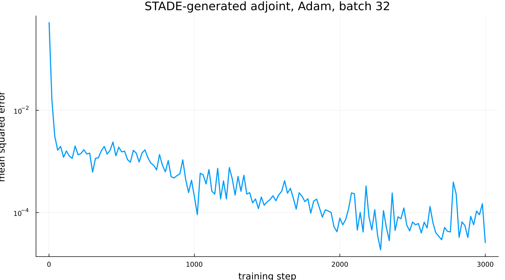
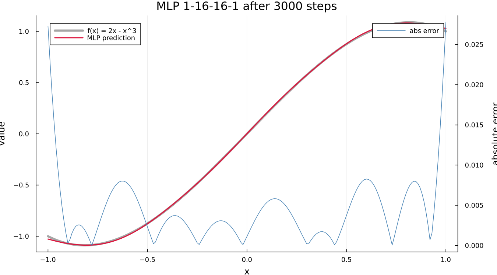

# MLP fit of f(x) = 2x - x^3 on (-1, 1)

Trained on one Tesla V100-PCIE-16GB using gradients generated by STADE.jl.
The kernel `mlp1d` is written for a single sample and has no batch loop.
STADE produced the adjoint, the CUDA port and the mini-batch epilogue;
the only hand-written numerics is Adam.

| | |
|---|---|
| architecture | 1 - 16 - 16 - 1, tanh |
| batch / steps | 32 / 3000 |
| train time | 393.42 s |
| final batch MSE | 2.5867e-05 |
| RMSE over the grid | 0.0061446 |
| max absolute error | 0.027764 |

The error concentrates at the endpoints. Uniform sampling on an open
interval gives a boundary point half the neighbouring data an interior
point sees, and tanh saturates there.
